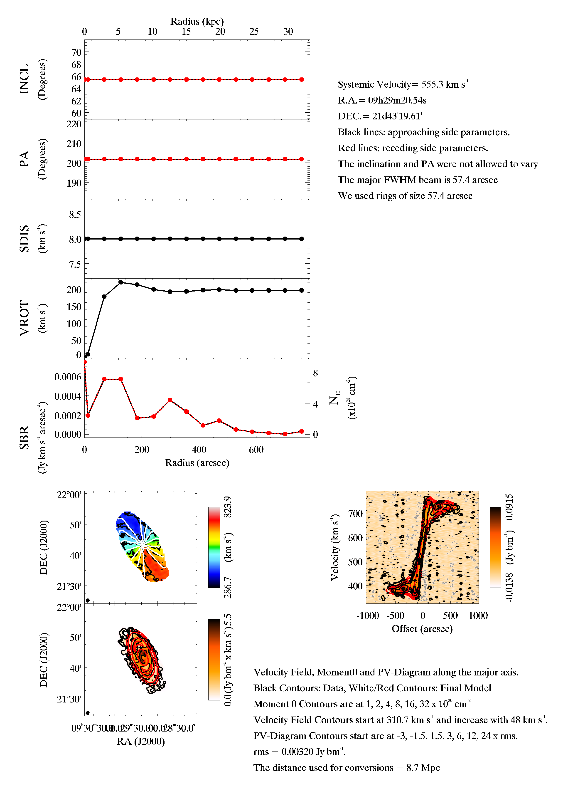

# Fully Automated TiRiFiC (FAT)
=====

Introduction
------------

The Fully Automated TiRiFiC is an IDL/GDL wrapper around the tilted ring fitting code  (TiRiFiC) that aims to fully automize the process of fitting tilted ring models to line emission cubes. This code is still in the development phase and hence errors and bugs can be there. Nevertheless the code has extensively been tested and the results and a more extensive description of the code are documented in [Kamphuis et al. 2015](http://arxiv.org/abs/1507.00413) 

The file [Current_Status.pdf](./Current_Status.pdf) contains an overview which shows the current performance of the current version on the master branch. If you find any error, are unhappy with FAT's results or just want to chat about tilted ring modelling pipelines please do no hesitate to contact me.

Requirements
------------
The code requires full installation of:

    IDL 7.0 or higher or GDL 0.9.6 or higher with astrolib
    TiRiFiC v2.2.3 or higher 
    SoFiA v 0.4.0 or higher  
    Standard unix commands pwd, mkdir, rm, cp, ls, python

[astrolib](http://idlastro.gsfc.nasa.gov/) (note the Coyote Library Dependencies for newer versions), [GDL](http://gnudatalanguage.sourceforge.net/), [IDL](https://www.harrisgeospatial.com/docs/using_idl_home.html),[TiRiFiC](http://gigjozsa.github.io/tirific/download_and_installation.html), [SoFiA](https://github.com/SoFiA-Admin/SoFiA)

IDL/GDL needs to be able to execute tirific, sofia, rename and the standard unix commands from a spawn command. All other dependencies should be in IDL and available with the normal IDL distributions. 

To run under GDL you will additionally need the package mpfit for GDL by Ole Streicher (https://packages.debian.org/sid/all/gdl-mpfit/download)
The GDL version is tested under Ubuntu 16.04 and runs after running the command

	sudo apt-get install gnudatalanguage gdl-astrolib gdl-mpfit libplplot-dev

Under ubuntu the astrolib package and mpfit package were not found after installation and hence a .gdlstartup file is required with the line

	!PATH=!PATH+':usr/share/gnudatalanguage/astrolib:usr/share/gnudatalanguage/coyote:usr/share/gnudatalanguage/mpfit'

Installation
------------

Unpack the zip file in a desired directory and you are ready to run FAT from this directory under IDL. 
The rename command might have to be aliased to rename -s, as this depends on which exact rename command and their are many versions available the code excutes the command "rename originalstring replacestring filesonwhichtoexecute" make sure that this is what the rename command does in the shell that is run by IDL.

You will also have to make a softlink in the Support directory to file sofia_pipeline.py in the sofia distribution i.e.:

	cd Support/
  	ln -s pathtosofiainstallation/sofia_pipeline.py sofia_pipeline.py
	
Once you have installed FAT you can check that it has been installed properly by running FAT as 
	
	IDL/GDL>.r FAT.pro
	IDL/GDL>FAT, /installation_check

This should take typically 10 min and should finish with the message:

	!!!!--------------------------------------------!!!!!
	!!!! As far as we can tell FAT is installed     !!!!!
	!!!! properly and runs smoothly.                !!!!!
	!!!!--------------------------------------------!!!!!

The check consists of fitting a flat disk on NGC 2903. The data for this galaxy were take as part of the WHISP program.
This survey is decribed in [van der Hulst et al. (2001)](http://adsabs.harvard.edu/abs/2001ASPC..240..451V) and the data can be found at [Westerbork on the Web](http://wow.astron.nl/) or the [WHISP page](https://www.astro.rug.nl/~whisp/).

If you get any other message please do not hesitate to file an issue here.

The fit done to check the installation will only leave the .def file and the overview plot that is produced. 
The directory Installation_Check will contain three overview files. Overview.png is the plot produced by your installation. Overview_IDL.png is for comparison with and IDL run and Overview_GDL.png for comparison with a GDL fit.

The plots should look like this:

Running FAT
-----------
FAT is currently run under GDL/IDL. It is called as a regular GDL/IDL program, i.e. in GDL/IDL:

    IDL/GDL >.r FAT.pro
    IDL/GDL >FAT,configuration_file='pathtodir/configfile.config',support='pathtosupportfilesdir'
    
All information that the code needs about output directories fitting steps and input parameters are taken from the configfile.
If a config file is not given it will look for the file 'FAT_INPUT.config' in the directory from which FAT is run.
The default support directory is ./Support however you can specify an alternative directory with the keyword support.

Configuration File
------

A configuration file will require the following parameters:

        catalogue=Path_to_catalog_dir/Catalog.txt

The code requires a catalogue with input sources to know which cubes to fit and where they are (See Below) the catalogue keyword should provide the path to this catalogue. There is no default for this.

        maindir=Path_to_dir_with_input/

maindir should contain the path where the directories for all galaxies are stored. FAT can produce large amounts of output if requested (e.g. Models for each step, xvdiagrams, Fitting logs, see maps_output parameter). In order to keep this managable each galaxy requires its own directory. There is no default for this parameter.

        outputcatalogue=Path/nameofresult.txt

The code will write a summary of the succes of the fit for each galaxy in this file. If not provided the code will produce increased output in the terminal.

        new_output='y'

new_ouput controls whether you want a new output catalogue with the summary of the fits done by FAT. If set to 'n'  the existing catalogue will be appendended. Typically you would want new output when starting a new batch fit and append if you are restarting a batch fit. Default ='y'

        startgalaxy=0

The catalogue number at which the code should start. The default is 0 which is the first line

        endgalaxy=-1

The catalogue number at which the code should stop. The default is -1 which means that it should run until the end of the catalog.

        outputlog=fitlog.txt

The name of a log file that will trace the iterations and steps that the code is executing for each galaxy. This file is written into the galaxy directory. If left out no log file will be written and additional output will be printed to the terminal.

        new_log='y'

Do you want to write a new log file. If set to 'n'  the existing log file will be appendended. Default='y'

        velocity_resolution=1

The velocity resolution of the data cubes. If set to zero the code assume that the instrumental dispersion is equal to a (1.2 x channel)/(2 x SQRT(2ln2)) otherwise (1+vresolution) x channel/(2 x SQRT(2ln2)). That is, if set to 1 it assumes Hanning smoothing. Default=1.

        maps_output = 2

Maps_output controls the amount of outpur created by FAT.  0.= all possible output (This is a lot), 1= all steps model + maps + def files, 2 = Final model + maps + def files for steps + logs, 3 = Only final model def + logs. Default = 2

	warp_output = 0
	
FAT provides the possibility to get information about the fitted warp (Tiltograms, Warp radius, Max angle) if this is required warp_output should be set to 1. 	

        allnew=1.

Parameter for setting the type of input for the initial guesses. possible setting are -1, 0, 1, 2 
-1) Start from orginal cube.
0) use initial guesses produced by FAT in a previous run. This is not recommended but can slightly speed up the start of the fitting. However it can lead to mismatches if slight changes have occured between runs.
1) Start from header and blank adjusted cube (i.e _preprocessed) (default)
2) Pre-produced SoFiA output should be used for the initial guesses. These need to be specified in the input catalog (See input catalog)

        finishafter=2.

Parameter for finishing the fitting process early. if set to one the program finishes after fitting the flat disk. Default = 2

        opt_pixelbeam=4.
        
The amount of pixels in the FWHM of the minor axis. Default = 4.

    

A default config file (FAT_INPUT.config) is included in the distribution.

Input Catalog
-----------

The input catalog should have at least 4 columns named as 

        number|distance|directoryname|cubename

and seperated by |
The number is an easy identifier to keep track of which galaxy is being fitted.
the distance is the distance to the galaxy in Mpc. This is used to make some initial guesses for the structure of the galaxy. If it is unknown it should be set to 1.
The directory name is the name of the directory of the galaxy to be fitted. This directory should be located in the specified maindir in the config file.
cubename is the name of the cube to be fitted. This should be without the fits extension.

An example catalog is included in the distribution. This also gives examples for how to set up a catalog when using pre-made sofia input, i.e. allnew=2

